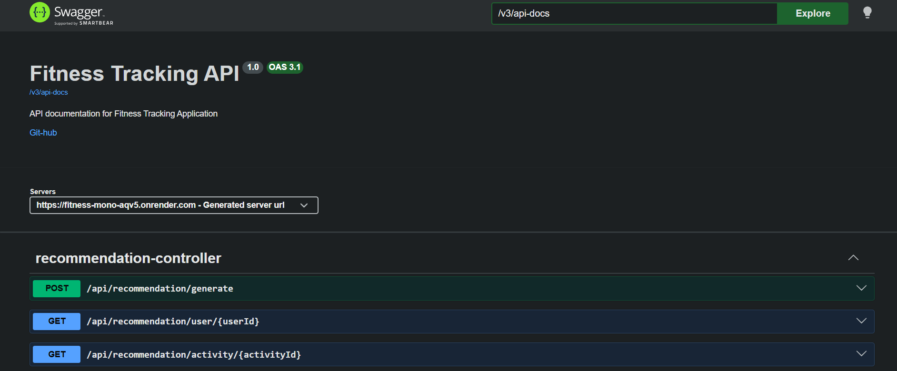
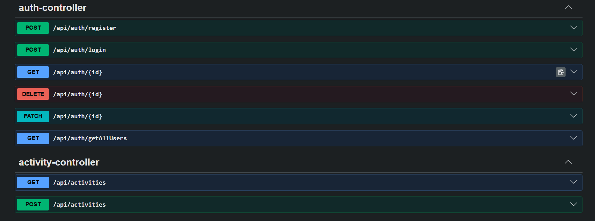
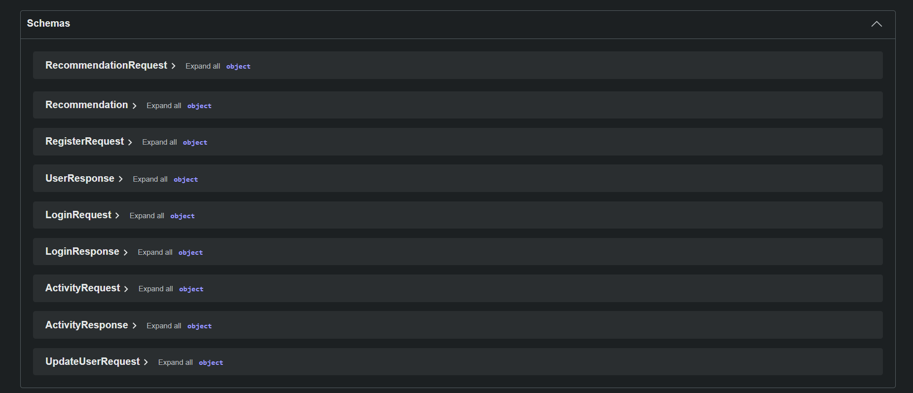

# 🏋️ Fitness Management Backend API


A **production-ready Spring Boot REST API** for managing fitness data.
This backend demonstrates modern Java backend practices including **JWT authentication, RBAC authorization, DTO architecture, Swagger documentation, and Docker containerization**.

---

# 🌐 Live Deployment

The application is deployed on **Render Cloud Platform**.

**Live API:**
https://fitness-mono-aqv5.onrender.com

**Swagger Documentation:**
https://fitness-mono-aqv5.onrender.com/swagger-ui/index.html

---

# 🚀 Features

* RESTful API built with **Spring Boot**
* **JWT Authentication & Authorization**
* **Role-Based Access Control (RBAC)**
* **DTO Pattern & Builder Pattern**
* **Spring Security Integration**
* **Password encryption using BCrypt**
* **Input validation**
* **Swagger API documentation**
* **Docker containerization**
* **Environment-based configuration**
* Clean layered architecture
* Production-ready deployment

---

# 🛠 Tech Stack

| Technology         | Purpose                        |
| ------------------ | ------------------------------ |
| Java 21            | Programming language           |
| Spring Boot        | Backend framework              |
| Spring Security    | Authentication & authorization |
| JWT                | Secure token authentication    |
| JPA / Hibernate    | ORM for database access        |
| MySQL / PostgreSQL | Relational database            |
| Swagger / OpenAPI  | API documentation              |
| Docker             | Containerization               |
| Maven              | Build automation               |
| Lombok             | Reduce boilerplate code        |

---

# 🏗 System Architecture

```
Client (Postman / Frontend)
        │
        ▼
+----------------------+
|     Controller       |
|  Handles API calls   |
+----------------------+
        │
        ▼
+----------------------+
|       Service        |
|   Business Logic     |
+----------------------+
        │
        ▼
+----------------------+
|     Repository       |
|  JPA / Hibernate ORM |
+----------------------+
        │
        ▼
+----------------------+
|       Database       |
| MySQL / PostgreSQL   |
+----------------------+
```

---

# 🔐 Security Architecture

```
Client Request
      │
      ▼
Spring Security Filter
      │
      ▼
JWT Authentication
      │
      ▼
Role-Based Access Control
      │
      ▼
Protected API Endpoints
```

---

# 📂 Project Structure

```
fitness-monolith
│
├── src
│   ├── main
│   │   ├── java/com.project.fitness
│   │   │
│   │   ├── config        → Application configuration
│   │   ├── controller    → REST API endpoints
│   │   ├── dto           → Data Transfer Objects
│   │   ├── exceptions    → Global exception handling
│   │   ├── model         → Entity classes
│   │   ├── repository    → Database repositories
│   │   ├── security      → JWT & Spring Security configuration
│   │   ├── services      → Business logic
│   │   └── FitnessMonolithApplication
│   │
│   └── resources
│       └── application.properties
│
├── Dockerfile
├── pom.xml
└── README.md
```

---

# ⚙ Environment Variables

Database credentials are configured using environment variables.

```
DB_URL=your_database_url
DB_USER=your_database_username
DB_PWD=your_database_password
```

Example in `application.properties`:

```
spring.datasource.url=${DB_URL}
spring.datasource.username=${DB_USER}
spring.datasource.password=${DB_PWD}
```

---

# ▶ Running the Application Locally

### 1. Clone Repository

```
git clone https://github.com/sumantkr1306/Fitness-TrackerApplication.git
cd fitness-monolith
```

### 2. Set Environment Variables

PowerShell example:

```
$env:DB_URL="jdbc:postgresql://your-db-host/database"
$env:DB_USER="username"
$env:DB_PWD="password"
```

### 3. Run Application

Windows:

```
.\mvnw.cmd spring-boot:run
```

Linux / Mac:

```
./mvnw spring-boot:run
```

---

# 🐳 Running with Docker

### Build Docker Image

```
docker build -t fitness-monolith .
```

### Run Container

```
docker run -p 8080:8080 fitness-monolith
```

---

# 📡 Example API Endpoint

```
POST /apiauth/register
```

Example Request

```
POST https://fitness-mono-aqv5.onrender.com/api/auth/register
```

Example Response

```json
{
    "id": "57166265-7e96-4aa8-bbe7-5f005c22d947",
    "email": "myfatherdmin@company.com",
    "password": "$2a$10$DIEr6FkD9x3ip/s0HuNxqeLgmfETcyNCfjYcW.sFrLnR6YQGjlXkW",
    "firstName": "ourAdmin",
    "lastName": "System",
    "createdAt": "2026-03-13T16:19:10.512565",
    "updatedAt": "2026-03-13T16:19:10.512654"
}
```

---


## 📷 Swagger API Documentation

The API is documented using Swagger and can be accessed interactively.

**Live Swagger URL**

https://fitness-mono-aqv5.onrender.com/swagger-ui.html

### Swagger Overview



### API Endpoints



### Request / Response Schemas


# 👨‍💻 Author

**Sumant Kumar**

GitHub
https://github.com/sumantkr1306

---

# 📜 License

This project is developed for **learning and educational purposes**
